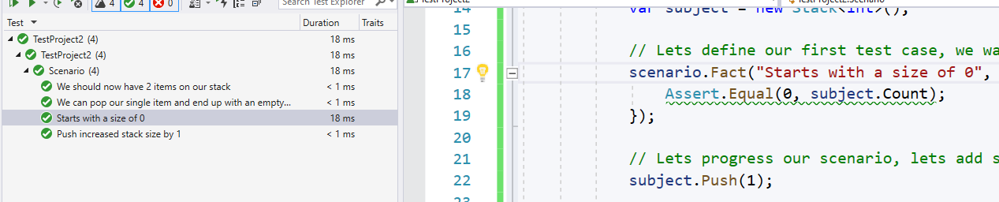
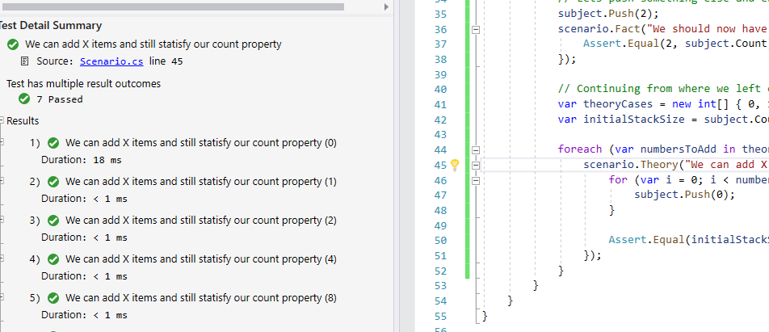

When developing software, you'll sooner or later be confronted with the notion of Tests. There are tons of resources available, both offline and online about testing software. In the .NET landscape we have plenty of [options](https://docs.microsoft.com/en-us/dotnet/core/testing/). Unit tests seem to be by far the most popular types of tests (based on the existing frameworks and their nuget download numbers). Lets imagine that we're implemting a Stack datatype and we now want to prove that we can Push something on our stack:

```csharp
[Fact]
void Push_IncreasesStackSize(){
    // arrange
    var subject = new Stack<int>(); // Subject here is the what we're testing against
    Assert.Equal(0, subject.Size); // Convenient but bad... read on

    // act
    subject.Push(1); // We push something on the stack

    // assert
    Assert.Equal(1, subject.Size);
}
```

This follows a typical arrange/act/assert pattern where in our arrange step we can setup a scenario, we then act on that scenario in our act step and finally we assert that our state is as we were expecting. We actually did something else. We had an initial assertion in our arrange step to ensure that we started out with a initial count of 0. 

Doing multiple assertions- or rather, asserting different and subsequently evolving cases within a single test is typically discouraged. The problem with this approach is that If my initial count was not 0 but lets say NULL (since nothing was yet pushed to the Stack) then my entire test would have failed including the Assertion that indeed pushing in 1 item would set the Stack size to 1. Instead I should have written 2 test methods:

```csharp
[Fact]
void StartsWithASizeOf0() {
    // act
    var subject = new Stack<int>(); 
    
    // assert
    Assert.Equal(0, subject.Size); 
}

[Fact]
void Push_IncreasesStackSize(){
    // arrange
    var subject = new Stack<int>();

    // act
    subject.Push(1);

    // assert
    Assert.Equal(1, subject.Size);
}
```

Okay, that's more code to write but at least we're clean now. Lets add another test case:

```csharp
[Fact]
void StartsWithASizeOf0() {
    // act
    var subject = new Stack<int>(); 
    
    // assert
    Assert.Equal(0, subject.Size); 
}

[Fact]
void Push_IncreasesStackSize(){
    // arrange
    var subject = new Stack<int>();

    // act
    subject.Push(1);

    // assert
    Assert.Equal(1, subject.Size);
}


[Fact]
void Pop_StackWith1Item_DecreasesStackSize(){
    // arrange
    var subject = new Stack<int>();
    subject.Push(1);

    // act
    subject.Pop();

    // assert
    Assert.Equal(0, subject.Size);
}
```

This is getting repetitive. Each additional test seems to be repeating what the previous test was doing while building on top of it. This gets worse when working with end-to-end testing where you actually test the [behavior](https://conductofcode.io/post/bdd-frameworks-for-dotnet-csharp/) of a system:

```csharp
public void Ensure_That_Item_Was_Ordered_For_New_User() {
    // Arrange
    var server = CreateTestServer();
    
    var productId = server.CreateProduct(new Product { ... });
    var shoppingCartId = server.CreateShoppingCart(userId);
    var userId = server.CreateUser(new User { });
    server.AssignCartToUser(userId, shoppingCartId)    
    server.AddProductInCart(productId, 1);

    // Act
    server.OrderCartContent(shoppingCartId);

    // Assert
    var order = server.GetLastOrder();
    Assert.Equal(shoppingCartId, order.ShoppingCartId);
}
```

Imagine having to write a second test that ensures that the order got shipped out. It would be a whole lot of repetition to get to a basic state and then some additional assertion. Yes, you could and probably should wrap up some of the arrangement steps in helper methods but that will only save you soo much... (I was running into this exact same issue when testing a service manipulating and querying a [Gremlin](https://tinkerpop.apache.org/gremlin.html) enabled database. There was little use in properly unit testing that service since each query would need to be parsed by an actual Gremlin enabled database). 

If I was to 'hack' this Server in an afternoon, I would typically not bother testing it and rather just implement a console application that would then play our a Scenario and I would make use of `Console.WriteLine` and the debugger to ensure that things are working as expected. A typical example would look just like you'd expect:

```csharp
async Task Main() {
    var server = CreateTestServer();
    var productId = server.CreateProduct(new Product { ... });
    var shoppingCartId = server.CreateShoppingCart(userId);
    var userId = server.CreateUser(new User { });
    server.AssignCartToUser(userId, shoppingCartId)    
    server.AddProductInCart(productId, 1);
    var order = server.GetLastOrder();
    var paymentId = server.CapturePayment(order.Id);
    var payment = server.GetPayment(paymentId);
    var shippingNumber = shippingService.Send(order.Id);

    Console.WriteLine($"Shipped your order with number {shippingNumber}");
}
```

Because I have the debugger at my disposal, I can simply intercept any step and do manual assertion (that is checking if states were updated as I would have expected them to be). This console application example is really an example of why [behavior driven development](https://en.wikipedia.org/wiki/Behavior-driven_development) (BDD for short) is a thing. BDD uses human readable descriptions of software user requirements. In my example, this description is implemented in C# since that is the language that I speak.

With [ScenarioTests](https://github.com/koenbeuk/ScenarioTests) I started an experiment to see if we can combine best of all worlds, that is:
1. Let me express a scenario from start to finish using a language that I'm comfortable in (in this case C#)
2. Let me add assertions along the way Testing the current state of that scenario
3. Let me branch out (e.g. use a non-existing UserID and assert how the subject should react if that was the case)

After prototyping a few ideas, I came up with a solution that reuses what we're already familiar with (in this case XUnit) while allowing the above 3 points to be met. As an example of our custom Stack sample introduced earlier in this post:

```csharp
[Scenario]
public void Scenario(ScenarioContext scenario) {
    // We create a subject as we would normally do
    var subject = new Stack<int>();
     
    // Lets define our first test case, we want to ensure that our stack starts out with a Size of 0
    scenario.Fact("Starts with a size of 0", () => {
        Assert.Equal(0, subject.Size);
    });
   
    // Lets progress our scenario, lets add something to the stack
    subject.Push(1);

    scenario.Fact("Push increased stack size by 1", () => {
        Assert.Equal(1, subject.Size);
    });

    // Lets see if we can pop our stack
    scenario.Fact("We can pop our single item and end up with an empty stack", () =>{
        subject.Pop();
        Assert.Equal(0, subject.Size);
    });

    // Lets push something else and ensure that the stack is growing accordingly
    subject.Push(2);
    scenario.Fact("We should now have 2 items on our stack", () => {
        Assert.Equal(2, subject.Size);
    });
}
```

And what you would see in VS:



What happened here? We expressed a scenario that essentially creates an empty stack, pushes an item and then pushes a second item. Along the way we were able to add assertions to test the scenario as it was at that stage. If you looked closely you would have seen that we actually manipulated our stack and Popped an item in one of our Tests. This however did not affect the subsequent tests in our scenario since it was encapsulated within that test. How did that work?

`ScenarioTests` uses a source generator that generates XUnit test methods for each invocation of `Assert` or `Theory` on the ScenarioContext that got passed in as an argument. That test method is then configured to run our Scenario while ending as soon as it hits a conclusion for that particular test. In case of our `Starts with a size of 0` test. It would end the scenario right after it was able to assert that the stack started with a size of 0.

Even if we were to throw an exception right in the middle of this Scenario, tests running before that exception will still pass. Because of this logic, we can even manipulate our Scenario within one of our test methods as demonstrated by our Pop call in one of our tests and stil have confidence that the manipulation does not affect subsequent tests.

This is all great but what about dealing with Theories. A Theory in XUnit is something that I'd like to describe as something that should be true for at least the input that I've tested it against. Let's say we wanted to continue our scenario and make sure that we can push many items onto our stack while still having the count go up accordingly, we can do just that:

```csharp
    // Continuing from where we left off, at this stage our stack contains 2 numbers
    var theoryCases = new int[] { 0, 1, 2, 4, 8, 16, 1024 };
    var initialStackSize = subject.Count; // Capture what we already had in the stack

    foreach (var numbersToAdd in theoryCases) {
        scenario.Theory("We can add X items and still statisfy our count property", numbersToAdd, () => {
            for (var i = 0; i < numbersToAdd; i++) {
                subject.Push(0);
            }

            Assert.Equal(initialStackSize + numbersToAdd, subject.Count);
        });
    }
```

And what we would see in VS:



### Conclusion
With ScenarioTests you can express your scenario in your favorite language (assuming that its C#, nothing it stopping this from working on other languages but it will need some work). ScenarioTests are currently still an experiment though they are being used widely in one of the businesses that I'm involved with and I would suspect a production ready version soon. Meanwhile I would really like your feedback (positive and negative). 

You can find the project on [Github](https://github.com/koenbeuk/ScenarioTests)
And pull it directly from [NuGet](https://www.nuget.org/packages/ScenarioTests.XUnit/)

More samples are available on [Github](https://github.com/koenbeuk/ScenarioTests/tree/master/samples) and in a separate [E2E test demo project](https://github.com/koenbeuk/SampleApiE2ETests)


